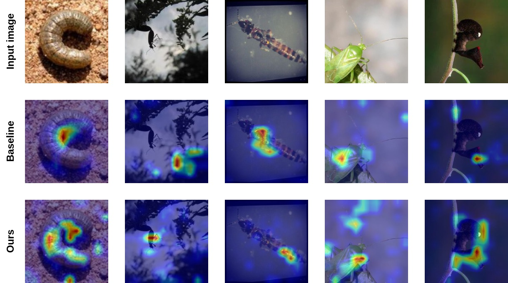

# Deep-Wide Learning Assistance for Insect Pest Classification

Official code of "Deep-Wide Learning Assistance for Insect Pest Classification."


We propose DeWi, the novel learning assistance for insect pest classification. With a one-stage and alternating training strategy, DeWi simultaneously enhances several Convolutional Neural Networks in two perspectives: discrimination (by leveraging the benefit of triplet margin loss in a supervised training manner) and generalization (with the help of data augmentation). From that, DeWi can learn discriminative and in-depth features of insect pests (deep) yet still generalize well to a large number of categories (wide).


Our DeWi models are better at focusing on meaningful features than the baseline methods. 


## Getting Started
We highly recommend you to create a separate conda environment for the project. Please follow the below steps to set up the environment and install the necessary packages.
```
conda create -n dewi python=3.8
conda activate dewi
conda install pytorch pytorch-cuda=11.6 -c pytorch -c nvidia
conda install pip
pip install -r requirements.txt
```

## Data
Download the IP102 dataset from [this URL](https://drive.google.com/drive/folders/1svFSy2Da3cVMvekBwe13mzyx38XZ9xWo) and the D0 dataset from [this URL](https://www.dlearningapp.com/web/DLFautoinsects.htm). After downloading, change the ```dataset_path``` in ```config.py``` to the path of the ```images``` folder.

## Running script
* Change the ```root``` and ```checkpoint_path``` in ```config.py``` to the appropriate paths.
* Assume you use the DeWi model with ResNet-152 variant, then run the following command to start training:

		python3 train.py dewi_resnet152

    After training each epoch, the validation and testing phases are automatically executed. The log files and checkpoint models are saved in the ```checkpoint_path```.
    Replace ```name = k[:]``` by ```name = k[7:]``` in ```utils/auto_load_resume``` if you want to training a model which is trained on multiple GPUs.

## Acknowledgement
Our source code is based on [Ung et al.](https://github.com/hieuung/Improving-Insect-Pest-Recognition-by-EnsemblingMultiple-Convolutional-Neural-Network-basedModels). Special thanks to them.

## Contact
For any concerns, please contact Nguyen Thanh Binh (Associate Professor at University of Science Ho Chi Minh city) via ngtbinh@hcmus.edu.vn.
